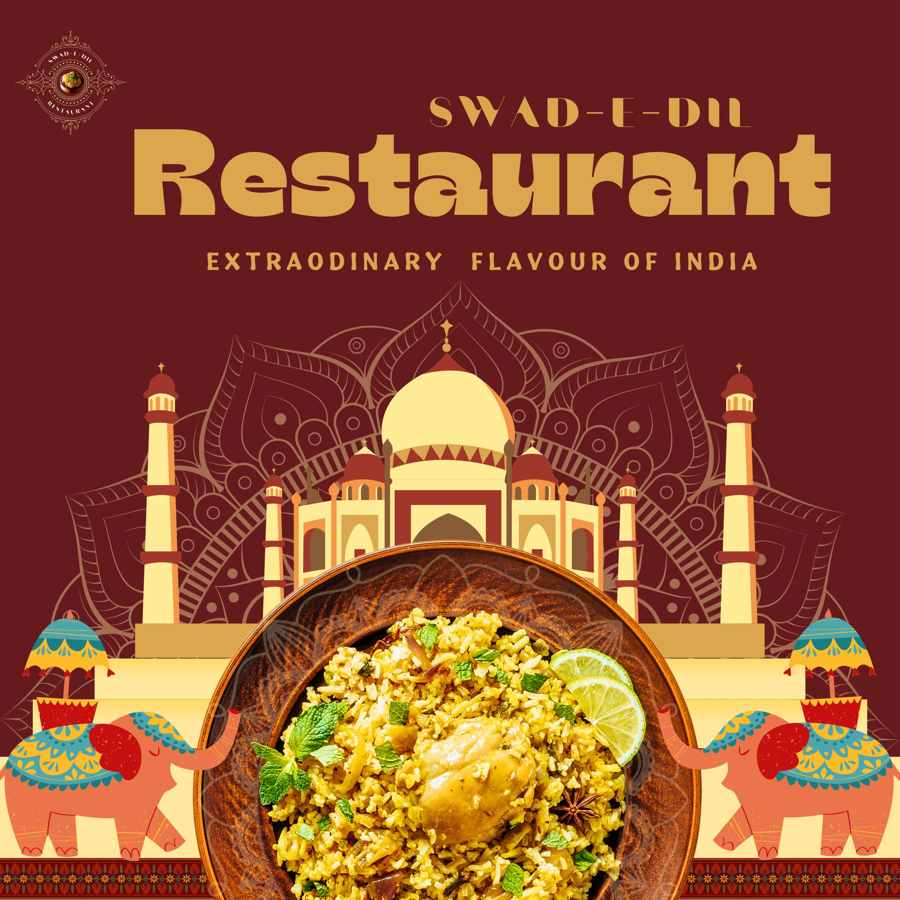

# 🍽️ Swad-e-Dil — *Swaad ka safar, parampara ke sang.*

> Authentic taste made with heart, served with health.



---

## 📌 Table of Contents

- [About the Project](#about-the-project)
- [Live Demo](#live-demo)
- [Features](#features)
- [Tech Stack](#tech-stack)
- [Pages & Sections](#pages--sections)
- [Menu Highlights](#menu-highlights)
- [Design](#design)
- [Project Structure](#project-structure)
- [Getting Started](#getting-started)
- [Contact](#contact)
- [License](#license)

---

## 📖 About the Project

**Swad-e-Dil** is a restaurant website built to showcase authentic Indian cuisine in a warm, welcoming digital space. The site reflects the soul of desi cooking from North Indian classics to coastal seafood platters while offering visitors an easy way to browse the menu, learn about the restaurant, and get in touch.

The project has been live for **5 years**, serving both loyal customers and first-time visitors with a seamless online experience.

---

## 🌐 Live Demo

🔗 **[https://swad-e-dil.vercel.app/](https://swad-e-dil.vercel.app/)**

---

## ✨ Features

- 🏠 **Hero Section** — Full-screen landing with tagline and call-to-action
- 👨‍🍳 **About Us** — Story and values of Swad-e-Dil
- 🍛 **Food Categories** — Veg, Non-Veg, and Special Thali with downloadable menu cards
- 📋 **Food Menu** — Curated dishes with descriptions and prices
- 💬 **Testimonials** — Real customer reviews
- 📬 **Contact Form** — Easy enquiry form with address, email, and phone
- 📱 **Fully Responsive** — Works smoothly across desktop, tablet, and mobile
- 🔗 **Smooth Navigation** — Single-page scrolling with a fixed navbar

---

## 🛠️ Tech Stack

| Technology | Purpose |
|---|---|
| **HTML5** | Page structure and semantic markup |
| **CSS3** | Custom styling and animations |
| **Bootstrap 5** | Responsive grid, components, and layout |
| **JavaScript** | Interactivity and dynamic behavior |
| **Canva** | All visual designs — banners, posters, and graphics |
| **Vercel** | Hosting and deployment |

---

## 📄 Pages & Sections

The website is a **single-page application (SPA)** with smooth scroll navigation across the following sections:

```
/ (index.html)
├── #home          → Hero / Landing Section
├── #about         → About the Restaurant
├── #food          → Food Categories (Veg / Non-Veg / Special Thali)
├── #food-menu     → Full Menu with Prices
├── #testimonials  → Customer Reviews
└── #contact       → Contact Form & Details
```

---

## 🍽️ Menu Highlights

| Dish | Description | Price |
|---|---|---|
| 🥘 Royal Thali Delight | North Indian classics butter naan, paneer butter masala, dal makhani & more | ₹350 |
| 🌴 Dakshin Bhojanam | South Indian combo dosa, medu vada, sambar, coconut chutney & payasam | ₹250 |
| 🦞 Coastal Catch – Seafood Platter | Prawn curry, fish fry, crab masala, steamed rice & sol kadhi | ₹400 |
| 🍚 Pakhala Bhata Traditional Platter | Authentic Odia dish fermented rice, saga bhaja, fried fish & badi chura | ₹350 |
| 🍗 Tandoori Non-Veg Treat | Tandoori chicken biryani, tikka, prawn kebab, butter naan & raita | ₹450 |
| 🥗 Desi Veg Lovers' Platter | Rajma, mix veg curry, puri, rice, raita, papad & gulab jamun | ₹250 |

---

## 🎨 Design

All visual assets — including posters, banners, menu card covers, and category images were **designed in Canva**.

- 🎯 Design Tool: **[Canva](https://www.canva.com/)**
- 🖼️ Assets include: hero poster, food category thumbnails, customer avatars, and the restaurant logo
- 🎨 Color palette: warm earthy tones reflecting authentic Indian cuisine

---

## 📁 Project Structure

```
swad-e-dil/
│
├── index.html              # Main HTML file
├── style.css               # Custom CSS styles
├── script.js               # JavaScript for interactivity
│
└── images/                 # All image assets (designed in Canva)
    ├── Swad-e-dil_Logo.jpg
    ├── Swad-e-dil_poster.jpg
    ├── Veg menu dp.jpg
    ├── nonveg menu dp.jpg
    ├── st dp.jpg
    ├── Royal Thali Delight.jpg
    ├── Dakshin Bhojanam.jpg
    ├── Coastal Catch – Seafood Combo Platter.jpg
    ├── Pakhala Bhata Traditional Platter.jpg
    ├── Tandoori Plater.jpg
    ├── Desi Veg Lovers' Platter.jpg
    ├── Customer 1.jpg
    ├── Customer 2.jpg
    └── Customer 3.jpg
```

---

## 🚀 Getting Started

No build tools or dependencies required. Just clone and open in a browser.

### 1. Clone the Repository

```bash
git clone https://github.com/your-username/swad-e-dil.git
```

### 2. Navigate to the Project Folder

```bash
cd swad-e-dil
```

### 3. Open in Browser

Simply open `index.html` in any modern browser:

```bash
# On macOS
open index.html

# On Windows
start index.html

# Or just drag and drop index.html into your browser
```

> ⚡ No server setup required it's a pure front-end project!

---

## 📬 Contact

For any queries, reservations, or feedback:

- 📧 **Email:** swad-e-dil@gmail.com
- 📞 **Phone:** +91 7854939308
- 📍 **Address:** Brehmapur, Ganjam, Odisha

---

## 📱 Follow Us

Stay connected for updates, offers, and food stories!

---

## 📜 License

© 2026 **WanderFramez\_**. All rights reserved.

> *"From soulful classics to chef's handpicked delights, we serve warmth on every plate."* 🍛

## 👨‍💻 Developer

<div align="center">

### ✨ Made with ❤️ by

# 🧑‍🍳 Anshuman Sahu


---

📧 **Email:** toanshumansahu@gmail.com
📞 **Phone:** +91 7854939308

---

[](https://github.com/anshuman-sahu-dev)
[](https://netflix-india-two.vercel.app/)
[](#)
[](#)

---


</div>
